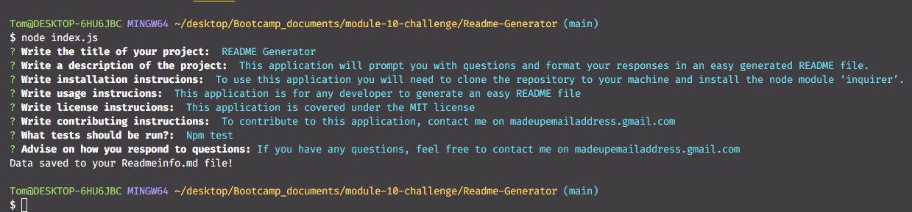

# README Generator 

    
## Description 
    
    
This application will prompt you with questions and format your responses in an easy generated README file. 

    
## Installation 
    
    
To use this application you will need to clone the repository to your machine and install the node module ‘inquirer’.

    
## Useage 
    
    
This application is for any developer to generate an easy README file

    
## License 
    
    
This application is covered under the MIT license

    
## Contributing 
    
    
To contribute to this application, contact me on madeupemailaddress.gmail.com

    
## Tests 
    
    
Npm test

    
## Questions 
    
    
If you have any questions, feel free to contact me on madeupemailaddress.gmail.com